**Sport Complex Client APP**

Application developed with WinForms | .NET5 Framework
> Application does not consist of any dependency packages & libraries 

Visitor can see:
* Sport Complexes
* Programms [SportTypes]
* Prices
* Events
* Vacancies

**Home page**

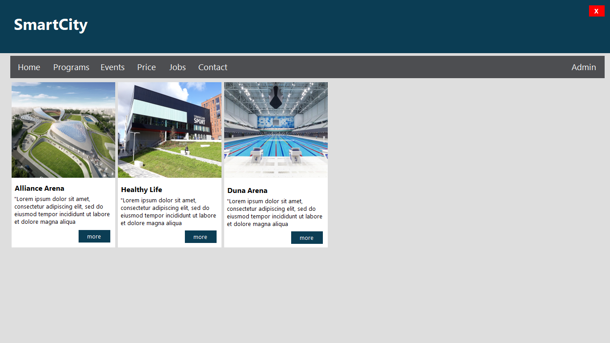

Here visitor can see available `Sport Complexes`.
 >Sport Complexes information cames from `City Administration Management Module`

**Available Sport Programms**

 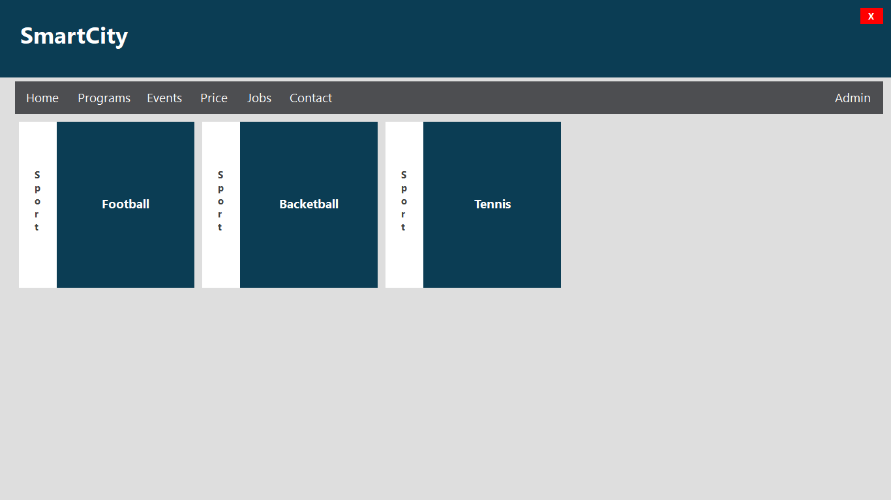

**Sport Events**

 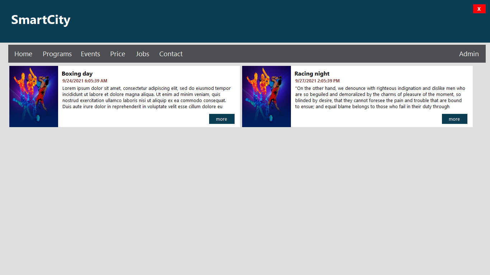

**Prices**

 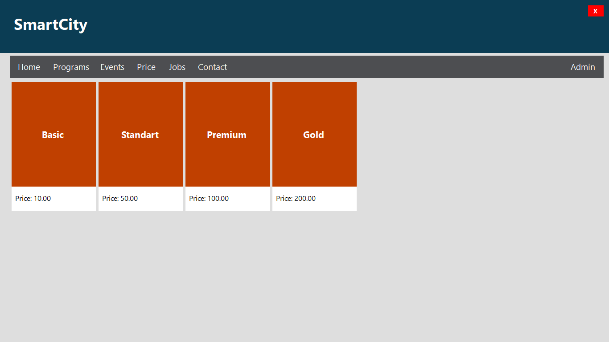

**Available Vacancies**

 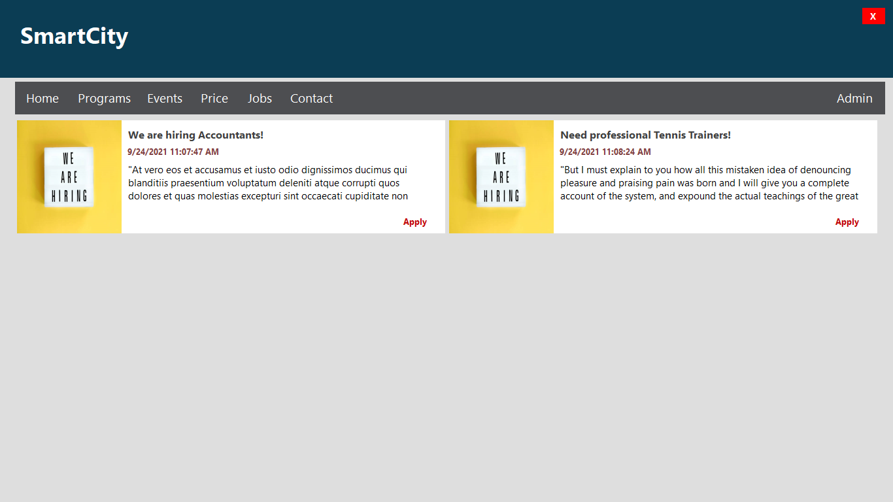

 In `Sport Module API` used basic *Bearer Authentication* method for authenticating `Administrator` of Complex.

 **Sign-In**

 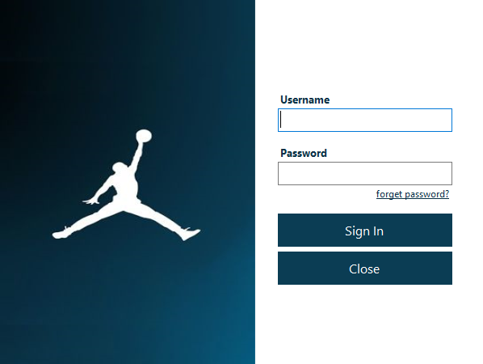

  **Creating Sport Programms**

 

 > Here getting info from `Sport.API` module.
 * update - using `PUT` method of **WebAPI** 
 * delete - using `DELETE` method of **WebAPI** 

  **Creating Positions for Complex Employees**

 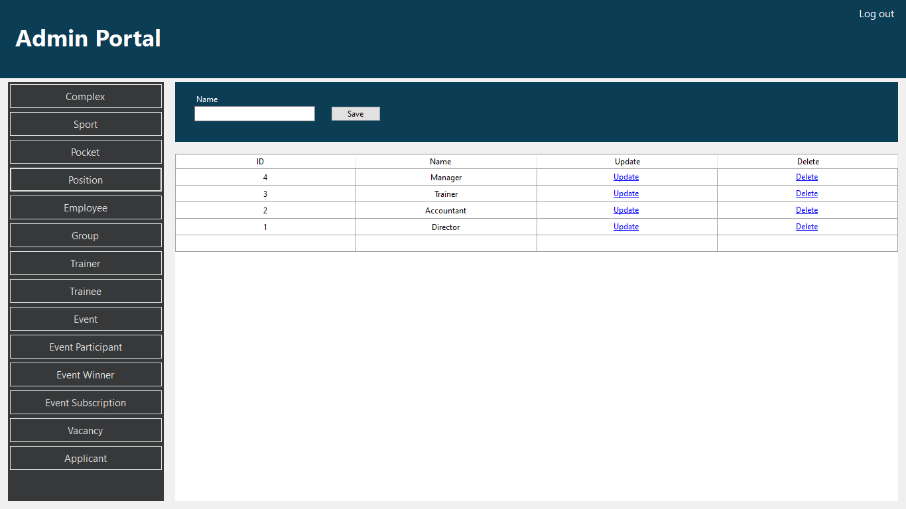

  **Creating Employee [Hiring an employee]**

 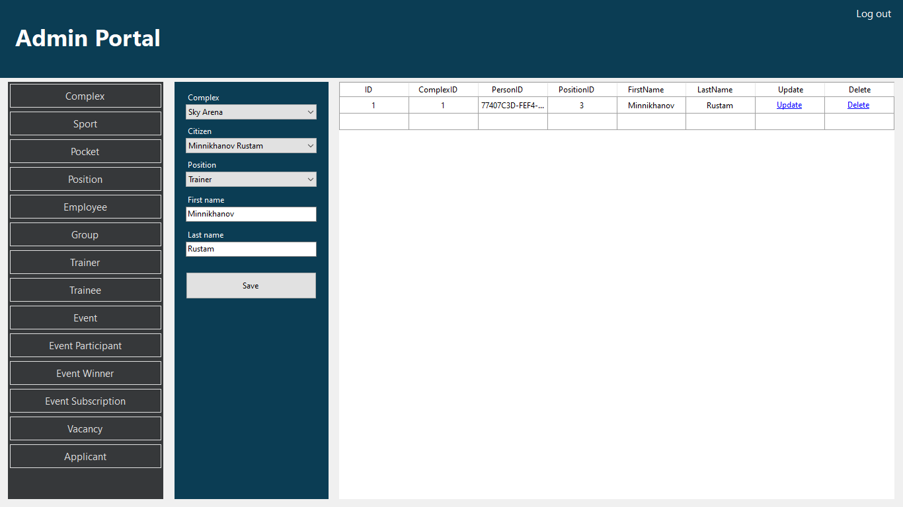

 * Complex - application loads information about Complexes from `City Administration Management Module` 
 * Citizen - application loads information about citizens from `People Management Module` 

**Creating Sport Groups For [Trainees & Trainers]**

 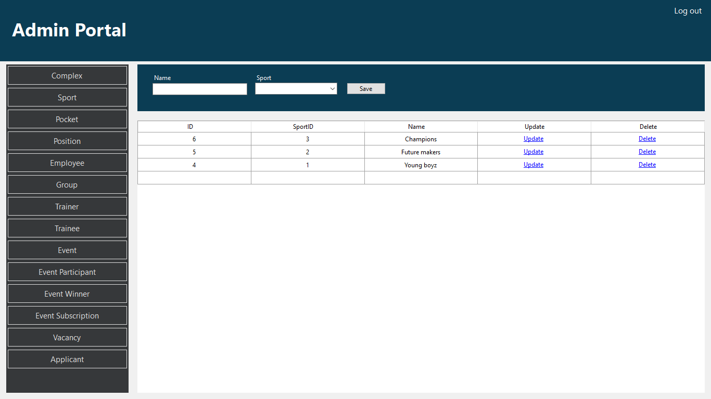

> Sport Groups created to make connection `trainees` with `trainers`

We have following functionality in `API` but not implemented in `Client` app:
* We can load all `Trainees` based on `Trainer`
* We can load `Trainer` based on `Trainee`
* We can load `Trainees` and `Trainers` based on `Group`

**Creating Trainer**

 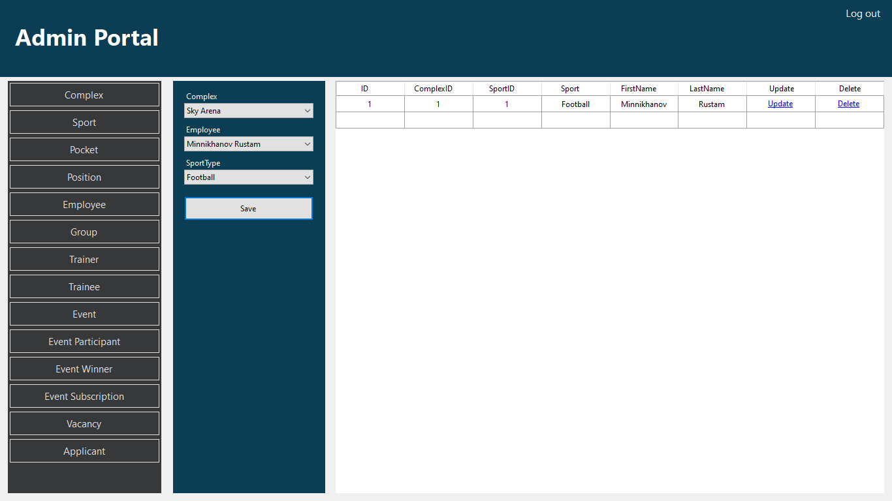

* Complex - from `City Administration Management Module`
* Employee - from `Employees` Table
* SportType - from `SportTypes` Table

**Enrolling to Sport Programm [Trainee Registration]**

 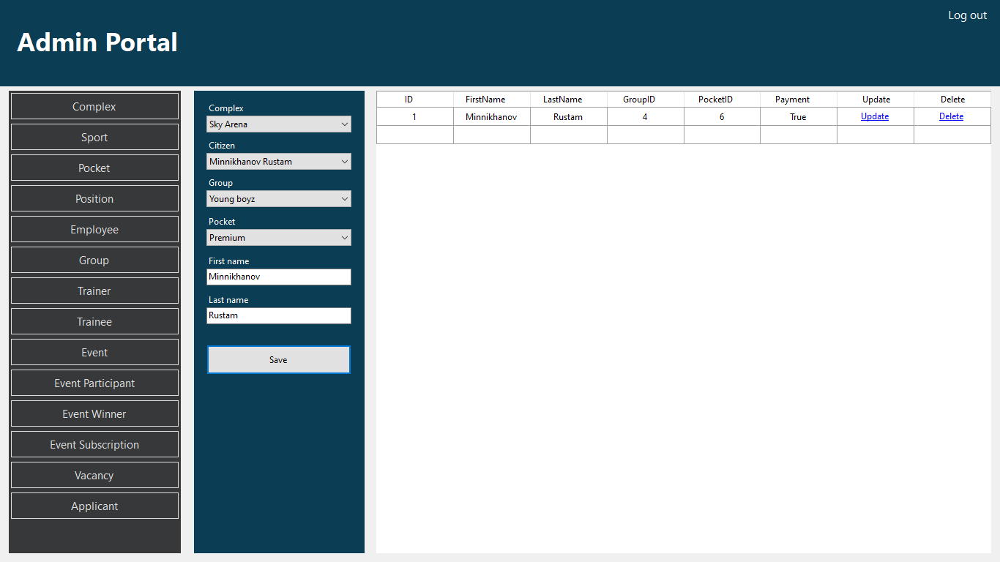

* Complex - from `City Administration Management Module`
* Citizen - from `People Management Module` 
* Group - from `SportGroups` Table
* Pocket - from `Pockets` Table

**Creating an Sport Event and approving from City Administration**

 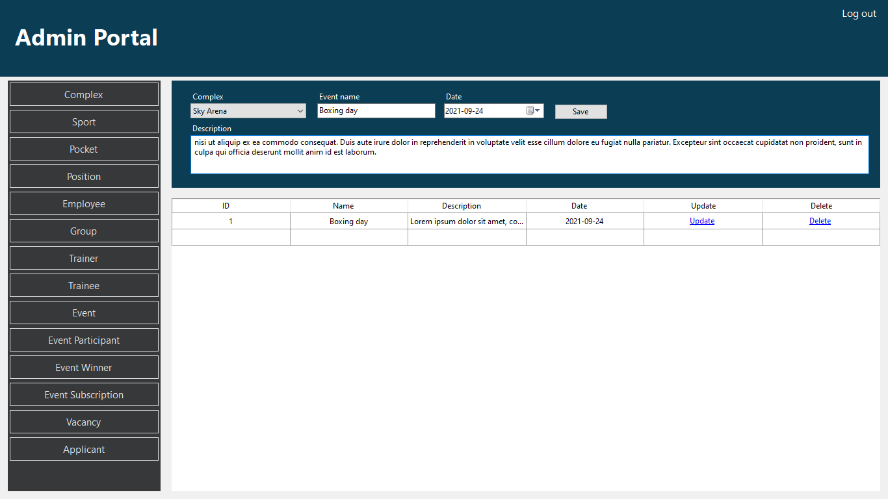

> After creating sport event `subscribers` get notifiaction about this event

**Creating and Posting Vacancy**

 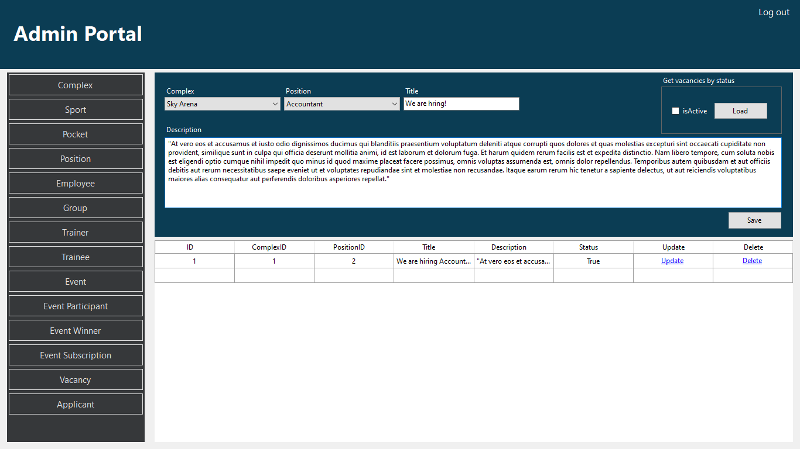

* Complex - from `City Administration Management Module`
* Position - from `Positions` Table 
